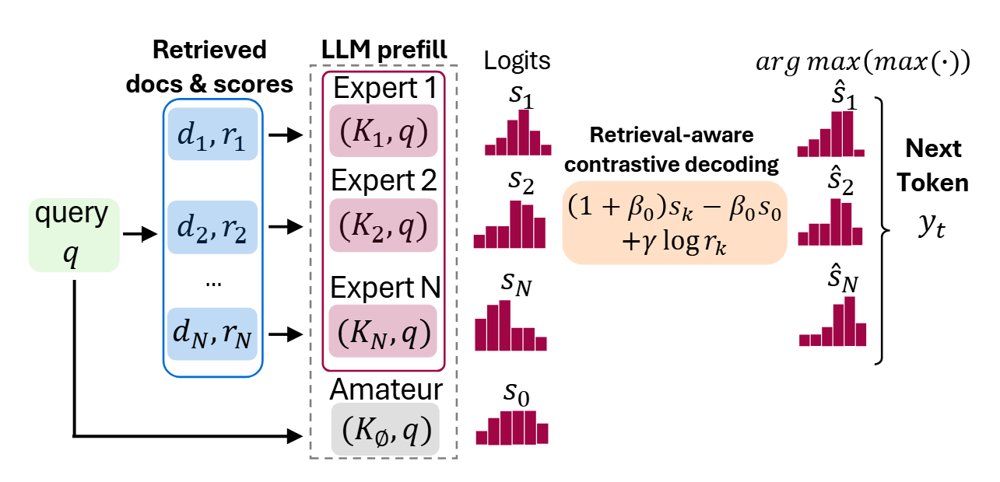

# langchain-pced

A LangChain integration for **Parallel Context-of-Experts Decoding (PCED)**, a training-free framework that addresses the evidence aggregation challenge in Retrieval-Augmented Generation (RAG) by shifting from attention-based to decoding-based fusion.

**Reference Paper:** [Parallel Context-of-Experts Decoding for Retrieval Augmented Generation](https://arxiv.org/abs/2601.08670)

## Method Overview

<p align="center">
  
</p>

<p align="center"><em>Figure 1: Overview of the Parallel Context-of-Experts Decoding (PCED) framework.</em></p>

PCED treats each retrieved document as an independent "expert" context, processing them in parallel rather than concatenating into a single sequence. At each decoding step, expert logits undergo contrastive transformation against an "amateur" (context-free) baseline, followed by retrieval-aware selection:

$$e_i^* = (1 + \beta) \cdot \text{logits}_{e_i} - \beta \cdot \text{logits}_{\text{amateur}}$$

$$\text{winner} = \arg\max_i \left[ \max(e_i^*) + \gamma \cdot s_i \right]$$

where $\beta$ is the contrastive strength (dynamically computed via JSD when unspecified), $\gamma$ weights the retrieval scores $s_i$, and the final token is sampled from the winning expert's distribution

## Installation

```bash
pip install langchain-pced
```

### Required: Flash Attention

Flash Attention is **required** for PCED to work. Install it before using the library:

```bash
pip install flash-attn --no-build-isolation
```

### Dependencies

| Package | Version | Purpose |
|---------|---------|---------|
| `transformers` | ≥ 5.0.0 | PagedAttention support for efficient KV cache management |
| `langchain-core` | ≥ 1.0.0 | Chain abstraction and prompt templating |
| `torch` | ≥ 2.0.0 | Tensor operations and CUDA support |

## Quick Start

This library follows standard LangChain patterns, providing `PCEDPromptTemplate` for template construction and supporting the canonical `prompt | chat | parser` chain composition.

### Basic Usage

```python
from langchain_pced import PCEDLLM, PCEDChatModel, PCEDPromptTemplate, harmonic_mean_fusion
from langchain_core.output_parsers import StrOutputParser

# Initialize the PCED-enabled LLM
llm = PCEDLLM.from_model_id(
    model_id="meta-llama/Llama-3.1-8B-Instruct",
    device="cuda:0",
)
chat = PCEDChatModel(llm=llm)

# Define the prompt template with expert placeholder specification
prompt = PCEDPromptTemplate.from_messages(
    messages=[
        ("system", "Answer ONLY using the provided context."),
        ("human", "Context:\n{context}\n\nQuestion:\n{question}"),
    ],
    expert_placeholder_key="context",  # Placeholder populated per-expert
)

# Retrieval scores (from your retrieval pipeline)
retrieval_scores = [0.9, 0.8, 0.7]
reranker_scores = [0.95, 0.6, 0.85]
fused_scores = harmonic_mean_fusion(retrieval_scores, reranker_scores)

# Retrieved documents
documents = [
    "The giant panda is a bear species endemic to China.",
    "Paris is the capital of France.",
    "Python is a programming language.",
]

# Construct and invoke the chain
chain = prompt | chat | StrOutputParser()

result = chain.invoke({
    "question": "What is a panda?",
    "expert_documents": documents,
    "expert_scores": fused_scores,
})
print(result)
```

### Optional: Answer Prefix

To constrain the model's response format, an optional `answer_prefix` can be specified:

```python
prompt = PCEDPromptTemplate.from_messages(
    messages=[
        ("system", "Answer ONLY using the provided context."),
        ("human", "Context:\n{context}\n\nQuestion:\n{question}"),
    ],
    expert_placeholder_key="context",
    answer_prefix="Based on the provided context, ",
)
```

## Comparative Analysis: PCED vs. Standard RAG

The following examples illustrate the key differences between standard RAG (context concatenation) and PCED (parallel expert decoding). Note that the retrieval and reranking stages are identical—only the generation methodology differs.

### Standard RAG Implementation

> **Additional Dependencies:**
> ```bash
> pip install langchain-huggingface>=1.0.0 langchain-community>=0.4.0
> ```

```python
from __future__ import annotations
from typing import List

from langchain_core.documents import Document
from langchain_core.vectorstores import InMemoryVectorStore
from langchain_core.prompts import ChatPromptTemplate
from langchain_core.output_parsers import StrOutputParser
from langchain_huggingface import HuggingFaceEmbeddings, HuggingFacePipeline, ChatHuggingFace
from langchain_community.cross_encoders import HuggingFaceCrossEncoder

# === Retrieval Infrastructure ===
embeddings = HuggingFaceEmbeddings(
    model_name="BAAI/bge-m3",
    model_kwargs={"device": "cuda"},
    encode_kwargs={"normalize_embeddings": True},
)
vectorstore = InMemoryVectorStore(embeddings)

docs = [
    Document(page_content="The giant panda is a bear species endemic to China."),
    Document(page_content="Paris is the capital of France."),
]
vectorstore.add_documents(docs)

cross_encoder = HuggingFaceCrossEncoder(
    model_name="BAAI/bge-reranker-v2-m3",
    model_kwargs={"device": "cuda"},
)

# === Retrieval and Reranking ===
def retrieve_and_rerank(query: str, top_k: int = 10, top_n: int = 3):
    pairs = vectorstore.similarity_search_with_score(query, k=top_k)
    docs, vec_scores, rerank_scores = [], [], []
    
    for d, score in pairs:
        docs.append(d)
        vec_scores.append(float(score))
    
    text_pairs = [(query, d.page_content) for d in docs]
    rerank_scores = list(cross_encoder.score(text_pairs))
    
    sorted_data = sorted(zip(docs, vec_scores, rerank_scores), 
                         key=lambda x: x[2], reverse=True)[:top_n]
    return ([d for d, _, _ in sorted_data], 
            [v for _, v, _ in sorted_data], 
            [r for _, _, r in sorted_data])

# === Standard RAG: Context Concatenation ===
base_llm = HuggingFacePipeline.from_model_id(
    model_id="Qwen/Qwen3-8B",
    task="text-generation",
    device_map="auto",
    pipeline_kwargs={"max_new_tokens": 512, "return_full_text": False},
)
chat_llm = ChatHuggingFace(llm=base_llm)

prompt = ChatPromptTemplate.from_messages([
    ("system", "Answer ONLY using the provided context."),
    ("human", "Context:\n{context}\n\nQuestion:\n{question}"),
])

chain = prompt | chat_llm | StrOutputParser()

question = "What is panda?"
top_docs, vec_scores, rerank_scores = retrieve_and_rerank(question)

# Concatenate all documents into single context
context = "\n\n".join(d.page_content for d in top_docs)
result = chain.invoke({"context": context, "question": question})
print(result)
```

### PCED Implementation

```python
from langchain_pced import PCEDLLM, PCEDChatModel, PCEDPromptTemplate, harmonic_mean_fusion
from langchain_core.output_parsers import StrOutputParser

# ... identical retrieval infrastructure as above ...

# === PCED: Parallel Expert Decoding ===
llm = PCEDLLM.from_model_id(
    model_id="Qwen/Qwen3-8B",
    device="cuda:0",
    max_new_tokens=512,
    enable_thinking=True
)
chat = PCEDChatModel(llm=llm)

prompt = PCEDPromptTemplate.from_messages(
    messages=[
        ("system", "Answer ONLY using the provided context."),
        ("human", "Context:\n{context}\n\nQuestion:\n{question}"),
    ],
    expert_placeholder_key="context",
)

question = "What is panda?"
top_docs, vec_scores, rerank_scores = retrieve_and_rerank(question)

# Fuse retrieval and reranker scores
fused_scores = harmonic_mean_fusion(vec_scores, rerank_scores)

chain = prompt | chat | StrOutputParser()

# Each document processed as independent expert
result = chain.invoke({
    "question": question,
    "expert_documents": [d.page_content for d in top_docs],
    "expert_scores": fused_scores,
})
print(result)
```

### Methodological Comparison

| Aspect | Standard RAG | PCED |
|--------|--------------|------|
| **Context Handling** | Documents concatenated into single sequence | Each document processed independently |
| **Attention Complexity** | $O((N \cdot L)^2)$ | $O(N \cdot L^2)$ |
| **Score Utilization** | Retrieval ranking only | Incorporated during decoding for expert weighting |
| **Cross-Document Reasoning** | Implicit via attention | Explicit via expert selection and score fusion |
| **Memory Efficiency** | Single long KV cache | Shared prefix with forked expert caches (PagedAttention) |

## Core Concepts

### Expert Documents and Scores

PCED treats each retrieved document as an independent "expert" that processes the query in isolation. Two inputs are required:

- **`expert_documents`**: A list of $N$ document strings
- **`expert_scores`**: A list of $N$ relevance scores (same cardinality as documents)

Scores are mandatory because PCED uses them to weight expert contributions during the decoding process.

### Score Fusion via Harmonic Mean

The `harmonic_mean_fusion()` function combines retrieval scores (e.g., dense vector similarity) with reranker scores (e.g., cross-encoder relevance):

```python
from langchain_pced import harmonic_mean_fusion

vec_scores = [0.9, 0.8, 0.7]      # Dense retrieval scores
rerank_scores = [0.95, 0.6, 0.85]  # Cross-encoder scores

fused = harmonic_mean_fusion(vec_scores, rerank_scores)
# Result: [0.924, 0.686, 0.768]
```

The harmonic mean is employed due to its conservative aggregation property—it penalizes cases where one score is low even when the other is high, promoting consensus between retrieval and reranking signals.

### Expert Placeholder Mechanism

The `expert_placeholder_key` parameter specifies which template variable is populated per-expert:

```python
prompt = PCEDPromptTemplate.from_messages(
    messages=[
        ("system", "Answer using the provided context."),
        ("human", "Context: {context}\n\nQuestion: {question}"),
    ],
    expert_placeholder_key="context",
)
```

PCED internally constructs:
- **Amateur prompt**: Template with `{context}` → empty string (no retrieval context)
- **Expert $i$ prompt**: Template with `{context}` → document $d_i$

## Streaming Support

PCED supports streaming generation for real-time applications:

```python
for chunk in chain.stream({
    "question": "What is a panda?",
    "expert_documents": [d.page_content for d in top_docs],
    "expert_scores": fused_scores,
}):
    print(chunk, end="", flush=True)
```

## API Reference

### PCEDLLM Parameters

| Parameter | Type | Default | Description |
|-----------|------|---------|-------------|
| `model_id` | `str` | required | HuggingFace model identifier |
| `beta` | `float` | `None` | Contrastive weight; `None` enables dynamic JSD-based computation |
| `gamma` | `float` | `2.5` | Retrieval score weight for expert selection |
| `max_new_tokens` | `int` | `256` | Maximum generation length |
| `temperature` | `float` | `None` | Sampling temperature (`None` uses model default) |
| `top_k` | `int` | `None` | Top-k sampling parameter |
| `top_p` | `float` | `None` | Nucleus sampling parameter |
| `do_sample` | `bool` | `None` | Enable stochastic sampling |
| `enable_thinking` | `bool` | `False` | Enable thinking mode (Qwen3-style models) |
| `device` | `str` | `"cuda:0"` | Computation device |
| `attn_implementation` | `str` | `"paged\|flash_attention_2"` | Attention implementation (requires flash-attn) |

**Note:** When sampling parameters are `None`, the model's `generation_config.json` defaults are used. For example:
- Llama-3.1: `do_sample=True, temperature=0.6, top_p=0.9`
- Qwen3: `do_sample=True, temperature=0.6, top_k=20, top_p=0.95`

### PCEDPromptTemplate.from_messages() Parameters

| Parameter | Type | Default | Description |
|-----------|------|---------|-------------|
| `messages` | `List[tuple]` | required | List of `(role, content)` tuples defining the prompt |
| `expert_placeholder_key` | `str` | `"context"` | Template variable populated per-expert |
| `answer_prefix` | `str` | `None` | Optional prefix prepended to model responses |

### chain.invoke() Parameters

| Parameter | Type | Required | Description |
|-----------|------|----------|-------------|
| `expert_documents` | `List[str]` | Yes | Document strings, one per expert |
| `expert_scores` | `List[float]` | Yes | Relevance scores (use `harmonic_mean_fusion`) |
| `<template_variables>` | `Any` | Varies | Additional template variables (e.g., `question`) |

## Citation

If you use this library in your research, please cite the original paper:

```bibtex
@article{corallo2026pced,
  title={Parallel Context-of-Experts Decoding for Retrieval Augmented Generation},
  author={Corallo, Giulio and Papotti, Paolo},
  journal={arXiv preprint arXiv:2601.08670},
  year={2026}
}
```

## License

This project is licensed under the MIT License.
